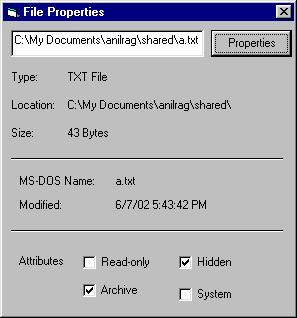



## File Properties

### Description

This Simple program (for Beginners) retrives file properties like Size, Modified date and time and also the File attributes. No API's, OCX's or DLL's. Just simple code anybody can understand. I hv tried to comment the code (I am not good at it though). Pls. Pls. Pls. VOTE
 
### More Info
 
Full path of the file needs to be typed (with extension)

eg:C:\WINDOWS\Desktop\FileProperties\Prop.txt

             |
---                |---
**Submitted On**   |2002-06-07 18:56:26
**By**             |[Anil Raghav](https://github.com/Planet-Source-Code/PSCIndex/blob/master/ByAuthor/anil-raghav.md)
**Level**          |Beginner
**User Rating**    |4.8 (24 globes from 5 users)
**Compatibility**  |VB 5\.0, VB 6\.0
**Category**       |[Files/ File Controls/ Input/ Output](https://github.com/Planet-Source-Code/PSCIndex/blob/master/ByCategory/files-file-controls-input-output__1-3.md)
**World**          |[Visual Basic](https://github.com/Planet-Source-Code/PSCIndex/blob/master/ByWorld/visual-basic.md)
**Archive File**   |[File\_Prope91396672002\.zip](https://github.com/Planet-Source-Code/anil-raghav-file-properties__1-35578/archive/master.zip)

